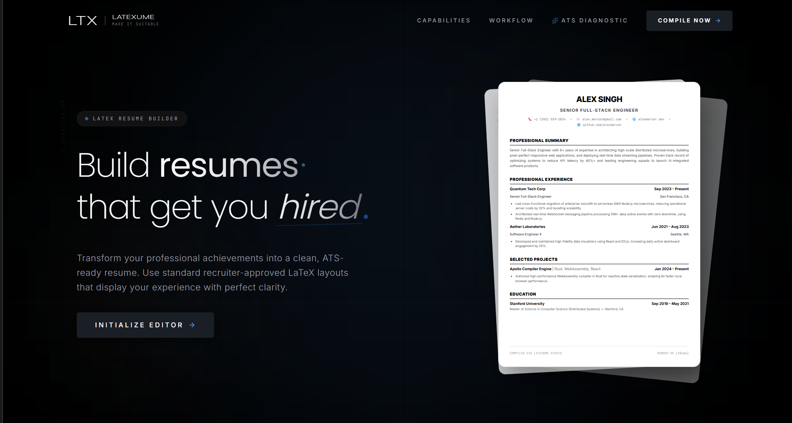
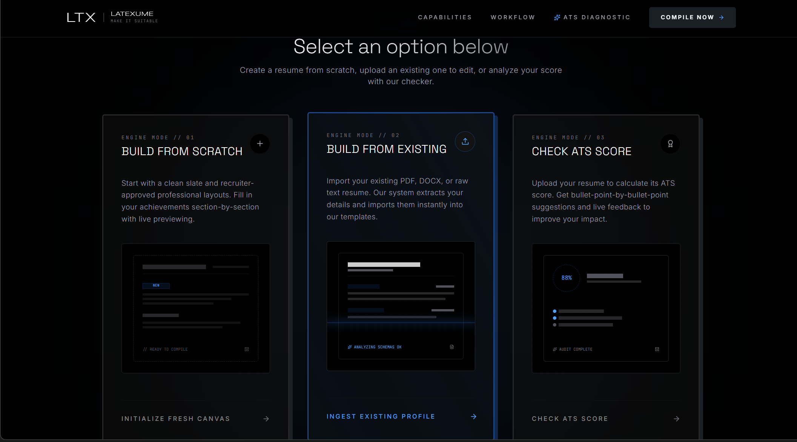
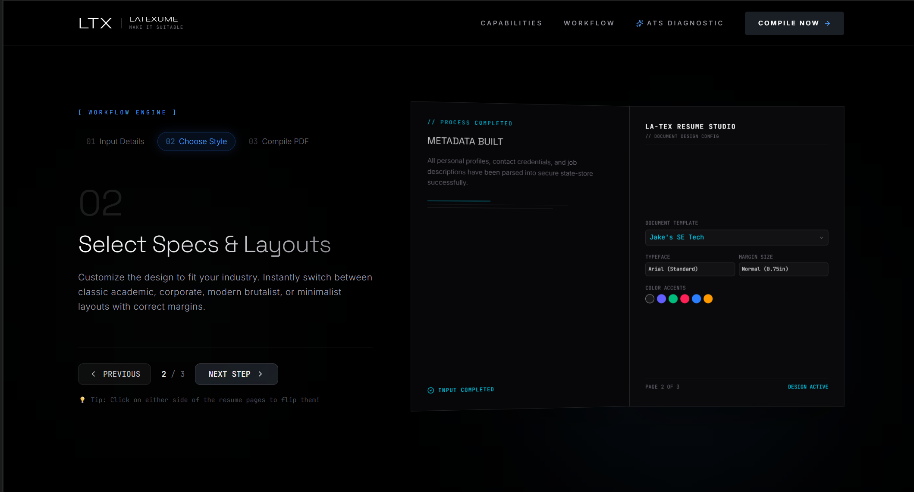
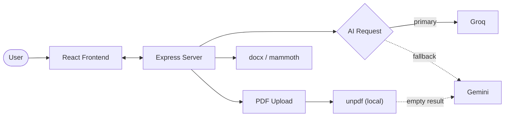

<div align="center">

# <td width="33%"></td>

### AI-Powered Resume Builder — Write Faster. Score Higher. Export Anywhere.

LateXume turns a rough resume into a polished, ATS-ready document — with live editing, AI-assisted rewrites, and one-click export to **LaTeX** or **Word**.

<p>


</p>
<p>


</p>

[Features](#-features) · [How It Works](#-how-it-works) · [Tech Stack](#-tech-stack) · [Getting Started](#-getting-started) · [Scripts](#-available-scripts)

</div>

---

## 🎬 Preview

<table>
<tr>
<td width="33%"></td>
<td width="33%"></td>
<td width="33%"></td>
</tr>
<tr>
<td align="center"><sub>Landing page</sub></td>
<td align="center"><sub>Scratch, import, or check your ATS score</sub></td>
<td align="center"><sub>Pick a template, typeface & accent</sub></td>
</tr>
</table>

---

## 🧭 Overview

Most resume tools make you choose: an editor that feels good to use, or an output that looks professional. **LateXume doesn't make you choose.**

Start from a blank page, import an existing resume, or paste in raw content — LateXume cleans it up, scores it against ATS signals, and exports it in the format you actually need.

| Goal | How LateXume helps |
|---|---|
| 🔁 Refresh an old resume | Import it, clean it up, keep editing |
| ✍️ Sharpen your bullets | AI rewrites for clarity and impact |
| 🎯 Pass the ATS scan | Live scoring + keyword suggestions |
| 📤 Export without the hassle | One click to LaTeX or Word, no manual formatting |
| 💾 Never lose a draft | Resume state autosaves in your browser |

---

## ✨ Features

- 🧩 **Structured editor** with a live, real-time preview
- 📊 **ATS scoring** with actionable improvement suggestions
- 🤖 **AI rewriting** for bullet points, summaries, and skills
- 📥 **Import from anywhere** — PDF, DOCX, images, Markdown, text, or JSON
- 📤 **Dual export** — LaTeX source *or* a ready-to-edit Word document
- 💾 **Local persistence** — your work is saved in-browser, reload-proof

---

## 🧠 How It Works

LateXume splits into two layers: a **React app** for editing and preview, and an **Express server** that handles AI calls and document parsing.



- **Groq runs first** for resume writing, rewriting, summaries, skills, and ATS-related generation.
- **Gemini is the fallback** — it only steps in when Groq isn't available.
- **PDF parsing tries locally first** with `unpdf`; if the extracted text comes back empty, Gemini extracts it server-side instead.

> [!TIP]
> Because of this fallback chain, Gemini can still appear in your server logs even when Groq is configured as primary — it's acting as a safety net, not the default writing engine.

---

## 🧰 Tech Stack

<table>
<tr>
<td valign="top" width="34%">

**Frontend**

- React 19
- TypeScript
- Vite
- Tailwind CSS v4
- Motion + GSAP
- Lucide React

</td>
<td valign="top" width="33%">

**Backend**

- Express
- Node.js
- tsx (dev runtime)
- esbuild (prod bundle)

</td>
<td valign="top" width="33%">

**AI & Documents**

- Groq SDK (primary AI)
- Google GenAI (fallback + PDF extraction)
- unpdf (local PDF text)
- docx (Word export)
- mammoth (DOCX import)

</td>
</tr>
</table>

---

## 📁 Supported File Formats

| Category | Formats |
|---|---|
| Documents | PDF, DOCX, DOC |
| Text | TXT, Markdown |
| Data | JSON |
| Images | PNG, JPG, JPEG, WebP, HEIC, HEIF |

---

## 🚀 Getting Started

**Fast path:**

```bash
git clone <your-repo-url>
cd LateXume
npm install
npm run dev
```

### Prerequisites

- Node.js **18+**

### 1 · Install dependencies

```bash
npm install
```

### 2 · Configure environment variables

Create a `.env.local` file in the project root with at least one AI key:

```bash
GROQ_API_KEY=your_groq_key
GEMINI_API_KEY=your_gemini_key
```

> [!IMPORTANT]
> Groq is the primary provider. Gemini is optional, but recommended as a backup and for PDF extraction fallback.

### 3 · Run in development

```bash
npm run dev
```

Starts the Express server and the frontend dev flow together.

### 4 · Build for production

```bash
npm run build
```

### 5 · Start the production server

```bash
npm start
```

---

## 📜 Available Scripts

| Command | Description |
|---|---|
| `npm run dev` | Starts the dev server via `tsx server.ts` |
| `npm run build` | Builds the Vite frontend and bundles the Node server |
| `npm start` | Runs the production server from `dist/server.cjs` |
| `npm run lint` | Type-checks the project with `tsc --noEmit` |
| `npm run clean` | Removes generated build output |

---

## ⚡ Why It's Fast

- 💾 Resume state lives in the browser, so reloads never wipe your work
- 📄 Local PDF extraction is always tried before any AI fallback
- ⚡ Groq handles most generation, keeping the main writing path quick
- 🔌 The server only wakes up for parsing, exporting, or AI calls
- 🖥️ Vite + modern React keep editing and previewing responsive

---

## 📝 Notes

> [!NOTE]
> - If Groq isn't configured, supported generation paths fall back to Gemini.
> - If Gemini isn't configured, PDF extraction fallback may be limited when local parsing fails.
> - The ATS checker is meant to guide improvement, not replace a real recruiter review.
> - Built for fast iteration and clean output over heavy design gimmicks.

---

## 🤝 Contributing

Issues and pull requests are welcome — feel free to open one if you spot a bug or have an idea.


<div align="center">

Built to make resumes less painful, one bullet point at a time.

</div>
